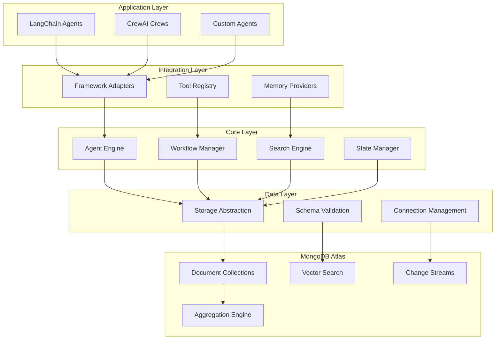
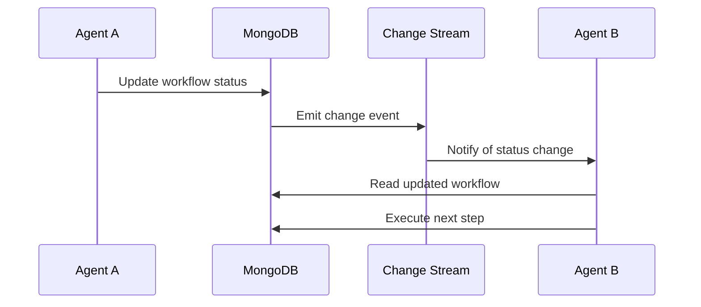

ng mcp # 🏛️ Architecture Guide

This document provides a comprehensive overview of the MongoDB AI Agent Boilerplate architecture, designed following MongoDB best practices and official documentation.

## 📋 Table of Contents

- [Overview](#overview)
- [Core Architectural Principles](#core-architectural-principles)
- [System Architecture](#system-architecture)
- [Data Architecture](#data-architecture)
- [Component Architecture](#component-architecture)
- [Integration Architecture](#integration-architecture)
- [Performance Architecture](#performance-architecture)
- [Security Architecture](#security-architecture)
- [Deployment Architecture](#deployment-architecture)

---

## Overview

The MongoDB AI Agent Boilerplate is designed as a comprehensive, production-ready foundation for building sophisticated AI agent systems. It leverages MongoDB's unified data platform to provide a single source of truth for all agent operations, from memory management to real-time coordination.

### Key Design Goals

1. **Unified Data Platform**: Single MongoDB database for all agent needs
2. **Production Ready**: Enterprise-grade reliability and performance
3. **Framework Agnostic**: Works with LangChain, CrewAI, and custom frameworks
4. **Scalable**: Designed for multi-agent, multi-tenant environments
5. **Observable**: Comprehensive monitoring and debugging capabilities

---

## Core Architectural Principles

### 1. MongoDB-First Design

Every component is designed to leverage MongoDB's native capabilities:

- **Document Model**: Natural representation of agent state and memory
- **Vector Search**: Semantic intelligence without external dependencies
- **Change Streams**: Real-time coordination between agents
- **Aggregation Pipelines**: Complex data processing in-database
- **TTL Indexes**: Automatic cleanup of temporary data

### 2. Layered Architecture



### 3. Event-Driven Architecture

Real-time coordination through MongoDB Change Streams:



---

## System Architecture

### High-Level System Overview

```mermaid
graph TD
    subgraph "Client Applications"
        CA[Web Apps]
        CB[Mobile Apps]
        CC[API Clients]
    end
    
    subgraph "AI Agent Layer"
        AL[LangChain Agents]
        AC[CrewAI Crews]
        AX[Custom Agents]
    end
    
    subgraph "MongoDB AI Agent Boilerplate"
        subgraph "Core Services"
            CS1[Agent State Manager]
            CS2[Workflow Engine]
            CS3[Tool Executor]
            CS4[Memory Manager]
        end
        
        subgraph "Search & Intelligence"
            SI1[Hybrid Search Engine]
            SI2[Vector Store]
            SI3[Semantic Router]
        end
        
        subgraph "Real-time Coordination"
            RC1[Change Stream Manager]
            RC2[Event Bus]
            RC3[Notification Service]
        end
        
        subgraph "Observability"
            OB1[Structured Logger]
            OB2[Performance Monitor]
            OB3[Trace Collector]
        end
    end
    
    subgraph "MongoDB Atlas"
        MA[Document Collections]
        MV[Vector Search]
        MC[Change Streams]
        MT[Time Series]
        MI[Indexes]
    end
    
    subgraph "External Services"
        ES1[OpenAI API]
        ES2[Anthropic API]
        ES3[Web APIs]
        ES4[Enterprise Systems]
    end
    
    CA --> AL
    CB --> AC
    CC --> AX
    
    AL --> CS1
    AC --> CS2
    AX --> CS3
    
    CS1 --> MA
    CS2 --> MV
    CS3 --> MC
    CS4 --> MT
    
    SI1 --> MV
    SI2 --> MI
    
    RC1 --> MC
    
    OB1 --> MT
    OB2 --> MA
    
    CS3 --> ES1
    CS3 --> ES2
    CS3 --> ES3
    CS3 --> ES4
```



### Component Interaction Flow

1. **Agent Request**: Client applications interact with AI agents
2. **State Management**: Agents load/save state through State Manager
3. **Tool Execution**: Agents execute tools through Tool Executor
4. **Memory Operations**: Agents store/retrieve memories through Memory Manager
5. **Search Operations**: Agents perform semantic search through Search Engine
6. **Real-time Updates**: Change streams notify agents of state changes
7. **Observability**: All operations are logged and monitored

---

## Data Architecture

### Collection Design

Following MongoDB best practices for document design:

#### 1. Agent Collections

```javascript
// agents - Agent definitions and configurations
{
  "_id": ObjectId("..."),
  "agent_id": "research_agent_v1",
  "name": "Research Agent",
  "version": "1.0.0",
  "status": "active",
  "capabilities": ["web_search", "data_analysis"],
  "model_config": {
    "provider": "openai",
    "model": "gpt-4",
    "temperature": 0.7
  },
  "performance_targets": {
    "max_response_time_seconds": 30,
    "min_confidence_score": 0.7
  },
  "created_at": ISODate("2024-01-20T10:00:00Z"),
  "updated_at": ISODate("2024-01-20T15:30:00Z")
}
```

#### 2. Memory Collections

```javascript
// agent_memory - Long-term agent memory
{
  "_id": ObjectId("..."),
  "memory_id": "mem_001",
  "agent_id": "research_agent_v1",
  "memory_type": "learned_pattern",
  "content": {
    "pattern": "SaaS companies mention scaling in Q4",
    "confidence": 0.89,
    "evidence": [...]
  },
  "embedding": [0.1, 0.3, -0.2, ...],
  "metadata": {
    "domain": "saas_industry",
    "relevance_score": 0.91
  },
  "created_at": ISODate("2024-01-20T10:00:00Z"),
  "last_accessed": ISODate("2024-01-20T15:30:00Z")
}

// agent_working_memory - Short-term memory with TTL
{
  "_id": ObjectId("..."),
  "session_id": "session_123",
  "agent_id": "research_agent_v1",
  "messages": [
    {
      "role": "user",
      "content": "Research Base44 company",
      "timestamp": ISODate("2024-01-20T15:00:00Z")
    }
  ],
  "expires_at": ISODate("2024-01-20T18:00:00Z"), // TTL field
  "created_at": ISODate("2024-01-20T15:00:00Z"),
  "updated_at": ISODate("2024-01-20T15:30:00Z")
}
```

#### 3. Vector Search Collections

```javascript
// vector_embeddings - Semantic search data
{
  "_id": ObjectId("..."),
  "embedding_id": "emb_001",
  "source_type": "research_result",
  "source_id": "research_base44_001",
  "agent_id": "research_agent_v1",
  "embedding": {
    "values": [0.1, 0.3, -0.2, ...], // 1024 dimensions
    "model": "text-embedding-ada-002",
    "dimensions": 1024
  },
  "content": {
    "text": "Base44 is an AI platform company...",
    "summary": "AI platform with database focus",
    "confidence": 0.87
  },
  "metadata": {
    "company": "Base44",
    "industry": "AI/SaaS",
    "data_type": "company_research"
  },
  "created_at": ISODate("2024-01-20T15:30:00Z")
}
```

#### 4. Workflow Collections

```javascript
// agent_workflows - Multi-agent coordination
{
  "_id": ObjectId("..."),
  "workflow_id": "workflow_123",
  "workflow_name": "Lead Processing Pipeline",
  "status": "in_progress",
  "workflow_definition": {
    "steps": [
      {
        "step_id": "research",
        "agent_id": "research_agent_v1",
        "description": "Research company",
        "depends_on": [],
        "timeout_seconds": 120
      },
      {
        "step_id": "analysis",
        "agent_id": "analysis_agent_v1", 
        "description": "Analyze research data",
        "depends_on": ["research"],
        "timeout_seconds": 60
      }
    ]
  },
  "execution_log": [
    {
      "step_id": "research",
      "status": "completed",
      "started_at": ISODate("2024-01-20T10:00:00Z"),
      "completed_at": ISODate("2024-01-20T10:02:00Z"),
      "output": {...}
    }
  ],
  "shared_context": {
    "company_name": "Base44",
    "research_data": {...}
  },
  "created_at": ISODate("2024-01-20T10:00:00Z"),
  "updated_at": ISODate("2024-01-20T10:02:00Z")
}
```

### Index Strategy

Following MongoDB indexing best practices:

#### 1. Compound Indexes

```javascript
// Optimized for common query patterns
db.agents.createIndex({ "agent_id": 1, "status": 1 });
db.agent_memory.createIndex({ "agent_id": 1, "memory_type": 1, "last_accessed": -1 });
db.agent_workflows.createIndex({ "status": 1, "created_at": -1 });
db.tool_executions.createIndex({ "agent_id": 1, "executed_at": -1 });
```

#### 2. Vector Search Indexes

```javascript
// Atlas Vector Search index
db.vector_embeddings.createSearchIndex(
  "vector_search_index",
  {
    "fields": [
      {
        "type": "vector",
        "path": "embedding.values",
        "numDimensions": 1024,
        "similarity": "cosine"
      },
      {
        "type": "filter",
        "path": "source_type"
      },
      {
        "type": "filter", 
        "path": "metadata.industry"
      }
    ]
  }
);
```

#### 3. TTL Indexes

```javascript
// Automatic cleanup of temporary data
db.agent_working_memory.createIndex(
  { "expires_at": 1 },
  { expireAfterSeconds: 0 }
);
```

---

## Component Architecture

### 1. Storage Abstraction Layer

Provides database-agnostic interfaces with MongoDB-optimized implementations:

```typescript
interface IDataStore<T> {
  create(item: T): Promise<T>;
  findById(id: string): Promise<T | null>;
  find(filter: Partial<T>): Promise<T[]>;
  update(id: string, item: Partial<T>): Promise<T | null>;
  delete(id: string): Promise<boolean>;
}

interface IEmbeddingStore {
  upsert(embedding: VectorEmbedding): Promise<void>;
  query(vector: number[], filters?: any, limit?: number): Promise<VectorSearchResult[]>;
}

interface IMemoryStore {
  getHistory(agentId: string, sessionId: string): Promise<ChatMessage[]>;
  addMessage(agentId: string, sessionId: string, message: ChatMessage): Promise<void>;
}
```

### 2. Agent Cognitive Engine

Core agent execution and state management:

```typescript
class AgentStateManager {
  async loadState(agentId: string): Promise<Agent>;
  async saveState(agent: Agent): Promise<void>;
  async updateConfiguration(agentId: string, config: Partial<AgentConfiguration>): Promise<void>;
}

class ToolExecutor {
  async execute(toolId: string, input: any, context: ToolExecutionContext): Promise<any>;
  async getToolDefinition(toolId: string): Promise<AgentTool>;
}

class WorkflowEngine {
  async createWorkflow(name: string, steps: WorkflowStep[], context?: any): Promise<Workflow>;
  async executeWorkflow(workflowId: string, options?: WorkflowExecutionOptions): Promise<void>;
}
```

### 3. Search & Intelligence Engine

Semantic search and hybrid capabilities:

```typescript
class HybridSearchEngine {
  async search(query: string, filters?: SearchFilters, options?: SearchOptions): Promise<HybridSearchResult[]>;
  async semanticSearch(query: string, filters?: SearchFilters, limit?: number): Promise<HybridSearchResult[]>;
  async textSearch(query: string, filters?: SearchFilters, limit?: number): Promise<HybridSearchResult[]>;
}
```

### 4. Real-time Coordination

Change stream-based event system:

```typescript
class ChangeStreamManager {
  constructor(db: Db, collectionName: string, pipeline: Document[], handler: ChangeHandler);
  async start(): Promise<void>;
  async stop(): Promise<void>;
}
```

---

## Integration Architecture

### Framework Integration Strategy

The boilerplate provides adapters for popular AI frameworks:

#### 1. LangChain Integration

```typescript
// Vector Store Integration
class MongoDBVectorStore extends VectorStore {
  async addDocuments(documents: Document[]): Promise<string[]>;
  async similaritySearch(query: string, k?: number, filter?: any): Promise<Document[]>;
}

// Chat Memory Integration
class MongoDBChatMessageHistory extends BaseChatMessageHistory {
  async getMessages(): Promise<BaseChatMessage[]>;
  async addMessage(message: BaseChatMessage): Promise<void>;
}
```

#### 2. CrewAI Integration

```typescript
// Crew Memory Integration
class MongoDBCrewMemory extends LongTermMemory {
  save(agentId: string, memoryData: any): Promise<void>;
  retrieve(agentId: string, query: string): Promise<any[]>;
}

// Tool Integration
class MongoDBTool extends BaseTool {
  async _run(input: string): Promise<string>;
}
```

### API Design Patterns

Following RESTful and GraphQL patterns for external integrations:

```typescript
// REST API endpoints
GET    /api/agents                    // List agents
POST   /api/agents                    // Create agent
GET    /api/agents/:id                // Get agent
PUT    /api/agents/:id                // Update agent
DELETE /api/agents/:id                // Delete agent

POST   /api/agents/:id/execute        // Execute agent
GET    /api/agents/:id/memory          // Get agent memory
POST   /api/agents/:id/memory          // Add to agent memory

GET    /api/workflows                 // List workflows
POST   /api/workflows                 // Create workflow
GET    /api/workflows/:id             // Get workflow status
POST   /api/workflows/:id/execute     // Execute workflow

POST   /api/search/vector             // Vector search
POST   /api/search/hybrid             // Hybrid search
POST   /api/search/semantic           // Semantic search
```

---

## Performance Architecture

### Optimization Strategies

#### 1. Aggregation Pipeline Optimization

Following MongoDB's aggregation optimization principles:

```javascript
// Optimized hybrid search pipeline
[
  // Stage 1: Vector search with proper numCandidates
  {
    $vectorSearch: {
      index: "vector_search_index",
      queryVector: queryEmbedding,
      path: "embedding.values",
      numCandidates: Math.max(limit * 10, 150), // MongoDB recommendation
      limit: limit * 2,
      filter: filterConditions
    }
  },
  
  // Stage 2: Add vector score immediately after $vectorSearch
  {
    $addFields: {
      vector_score: { $meta: "vectorSearchScore" }
    }
  },
  
  // Stage 3: Apply filters early in pipeline
  {
    $match: {
      "content.confidence": { $gte: 0.7 }
    }
  },
  
  // Stage 4: Sort before limit for optimization
  { $sort: { vector_score: -1 } },
  
  // Stage 5: Limit results
  { $limit: limit }
]
```

#### 2. Index Strategy

Compound indexes for common query patterns:

```javascript
// Query: Find active agents by capability
db.agents.createIndex({ "status": 1, "capabilities": 1, "created_at": -1 });

// Query: Get agent memory by type and recency
db.agent_memory.createIndex({ "agent_id": 1, "memory_type": 1, "last_accessed": -1 });

// Query: Find workflows by status and creation time
db.agent_workflows.createIndex({ "status": 1, "created_at": -1 });
```

#### 3. Memory Management

TTL indexes for automatic cleanup:

```javascript
// Working memory expires after session timeout
db.agent_working_memory.createIndex(
  { "expires_at": 1 },
  { expireAfterSeconds: 0 }
);

// Tool executions cleanup after 30 days
db.tool_executions.createIndex(
  { "executed_at": 1 },
  { expireAfterSeconds: 2592000 }
);
```

### Performance Monitoring

Built-in performance tracking:

```typescript
// Performance metrics collection
interface PerformanceMetrics {
  agent_id: string;
  operation: string;
  duration_ms: number;
  success: boolean;
  cost_usd?: number;
  tokens_used?: number;
  confidence_score?: number;
}

// Automatic performance logging
class PerformanceMonitor {
  async logOperation(metrics: PerformanceMetrics): Promise<void>;
  async getMetrics(agentId: string, timeWindow: string): Promise<AggregatedMetrics>;
}
```

---

## Security Architecture

### Authentication & Authorization

Multi-layered security approach:

#### 1. MongoDB Security

```javascript
// Role-based access control
{
  "role": "agentOperator",
  "db": "ai_agents",
  "privileges": [
    {
      "resource": { "db": "ai_agents", "collection": "agents" },
      "actions": ["find", "insert", "update"]
    },
    {
      "resource": { "db": "ai_agents", "collection": "agent_memory" },
      "actions": ["find", "insert", "update", "remove"]
    }
  ]
}
```

#### 2. Field-Level Encryption

```javascript
// Encrypt sensitive agent data
{
  "encryptedFields": {
    "fields": [
      {
        "path": "model_config.api_key",
        "bsonType": "string",
        "keyId": "encryption-key-id"
      },
      {
        "path": "secure_credentials.encrypted_value",
        "bsonType": "string", 
        "keyId": "encryption-key-id"
      }
    ]
  }
}
```

#### 3. Agent Permissions

```javascript
// agent_permissions collection
{
  "agent_id": "research_agent_v1",
  "permissions": [
    {
      "tool_id": "web_search",
      "policy": "always_allow"
    },
    {
      "tool_id": "send_email",
      "policy": "requires_human_approval",
      "approver_group": "supervisors"
    }
  ]
}
```

### Data Protection

#### 1. Encryption at Rest

MongoDB Atlas provides automatic encryption at rest using AES-256.

#### 2. Encryption in Transit

All connections use TLS 1.2+ with certificate validation.

#### 3. Audit Logging

```javascript
// Enable audit logging for sensitive operations
{
  "auditLog": {
    "destination": "file",
    "format": "JSON",
    "filter": {
      "atype": { "$in": ["authenticate", "authCheck", "createUser", "dropUser"] }
    }
  }
}
```

---

## Deployment Architecture

### MongoDB Atlas Deployment

#### 1. Cluster Configuration

```yaml
# Recommended Atlas configuration
cluster_tier: M10  # Minimum for vector search
region: us-east-1
backup_enabled: true
pit_enabled: true  # Point-in-time recovery

# Vector search requirements
vector_search_enabled: true
search_nodes: 1  # Dedicated search nodes for performance

# Security
network_access:
  - ip_address: "0.0.0.0/0"  # Configure appropriately
    comment: "Application servers"

database_users:
  - username: "agent-app"
    password: "secure-password"
    roles:
      - role: "readWrite"
        db: "ai_agents"
```

#### 2. Index Creation Strategy

```bash
#!/bin/bash
# Automated index creation script

# Vector search indexes
mongosh "$MONGODB_URI" --eval "
db.vector_embeddings.createSearchIndex(
  'vector_search_index',
  {
    'fields': [
      {
        'type': 'vector',
        'path': 'embedding.values',
        'numDimensions': 1024,
        'similarity': 'cosine'
      }
    ]
  }
);
"

# Standard indexes
mongosh "$MONGODB_URI" --eval "
db.agents.createIndex({ 'agent_id': 1, 'status': 1 });
db.agent_memory.createIndex({ 'agent_id': 1, 'memory_type': 1, 'last_accessed': -1 });
db.agent_workflows.createIndex({ 'status': 1, 'created_at': -1 });
"

# TTL indexes
mongosh "$MONGODB_URI" --eval "
db.agent_working_memory.createIndex(
  { 'expires_at': 1 },
  { expireAfterSeconds: 0 }
);
"
```

### Application Deployment

#### 1. Docker Configuration

```dockerfile
FROM node:18-alpine

WORKDIR /app

# Install dependencies
COPY package*.json ./
RUN npm ci --only=production

# Copy application code
COPY . .

# Build application
RUN npm run build

# Set environment variables
ENV NODE_ENV=production
ENV LOG_LEVEL=info

# Health check
HEALTHCHECK --interval=30s --timeout=3s --start-period=5s --retries=3 \
  CMD curl -f http://localhost:3000/health || exit 1

# Expose port
EXPOSE 3000

# Start application
CMD ["npm", "start"]
```

#### 2. Kubernetes Deployment

```yaml
apiVersion: apps/v1
kind: Deployment
metadata:
  name: mongodb-ai-agent
spec:
  replicas: 3
  selector:
    matchLabels:
      app: mongodb-ai-agent
  template:
    metadata:
      labels:
        app: mongodb-ai-agent
    spec:
      containers:
      - name: agent
        image: mongodb-ai-agent:latest
        ports:
        - containerPort: 3000
        env:
        - name: MONGODB_URI
          valueFrom:
            secretKeyRef:
              name: mongodb-secret
              key: uri
        - name: OPENAI_API_KEY
          valueFrom:
            secretKeyRef:
              name: openai-secret
              key: api-key
        resources:
          requests:
            memory: "256Mi"
            cpu: "250m"
          limits:
            memory: "512Mi"
            cpu: "500m"
        livenessProbe:
          httpGet:
            path: /health
            port: 3000
          initialDelaySeconds: 30
          periodSeconds: 10
        readinessProbe:
          httpGet:
            path: /ready
            port: 3000
          initialDelaySeconds: 5
          periodSeconds: 5
```

### Monitoring & Observability

#### 1. Application Monitoring

```typescript
// Structured logging with correlation IDs
logger.info('Agent execution started', {
  trace_id: 'trace_123',
  workflow_id: 'workflow_456',
  agent_id: 'research_agent_v1',
  operation: 'execute_workflow'
});

// Performance metrics
logger.agentMetrics({
  agent_id: 'research_agent_v1',
  operation: 'research_company',
  success: true,
  duration_ms: 2500,
  cost_usd: 0.15,
  confidence_score: 0.89
});
```

#### 2. MongoDB Monitoring

```javascript
// Performance monitoring queries
db.runCommand({
  "serverStatus": 1,
  "metrics": 1,
  "locks": 1,
  "opcounters": 1
});

// Index usage statistics
db.collection.aggregate([
  { $indexStats: {} }
]);

// Change stream monitoring
db.runCommand({
  "serverStatus": 1,
  "changeStreams": 1
});
```

---

## Conclusion

This architecture provides a robust, scalable foundation for building sophisticated AI agent systems. By leveraging MongoDB's unified data platform, we achieve:

1. **Simplified Architecture**: Single database for all agent needs
2. **Enhanced Performance**: Optimized queries and indexes
3. **Real-time Capabilities**: Change streams for coordination
4. **Production Readiness**: Security, monitoring, and deployment patterns
5. **Framework Flexibility**: Works with any AI framework

The architecture follows MongoDB best practices and official documentation, ensuring reliability, performance, and maintainability at scale.

## References

- [MongoDB Atlas Vector Search Documentation](https://docs.atlas.mongodb.com/atlas-vector-search/)
- [MongoDB Change Streams Documentation](https://docs.mongodb.com/manual/changeStreams/)
- [MongoDB Aggregation Pipeline Optimization](https://docs.mongodb.com/manual/core/aggregation-pipeline-optimization/)
- [MongoDB Index Best Practices](https://docs.mongodb.com/manual/applications/indexes/)
- [MongoDB Security Best Practices](https://docs.mongodb.com/manual/security/)
- [MongoDB Performance Best Practices](https://docs.mongodb.com/manual/administration/analyzing-mongodb-performance/)